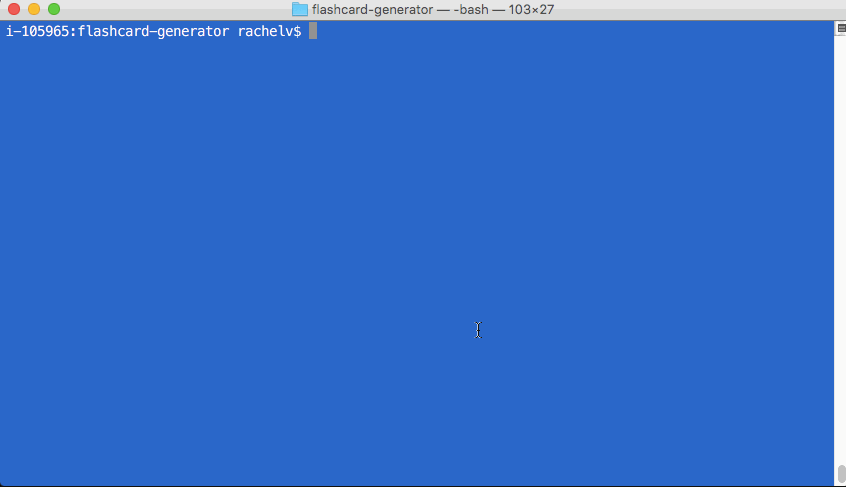

# flashcard-generator

A back-end Node app (with CLI) generating two different kinds of flashcards. With modularized code, both flashcards have their code in separate files, with a main.js file to initiate the user prompt and requiring in both other files.

Just follow the prompt!

1. Basic cards:

Following the prompt, the user can create however many cards they want (validation ensures only numbers can be input). The question will be shown as displaying on the front of the card, and the answer on the back.

2. Cloze cards:

Same functionality as the basic card, but with a segment being removed from the sentence the user inputs. Created cards include the partial, the answer, and the full text.

